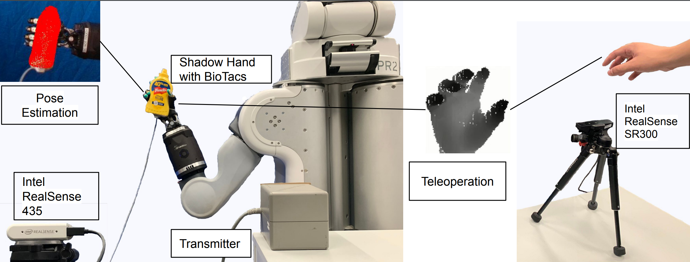
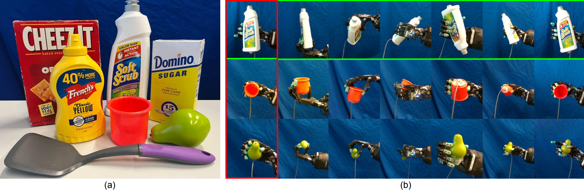
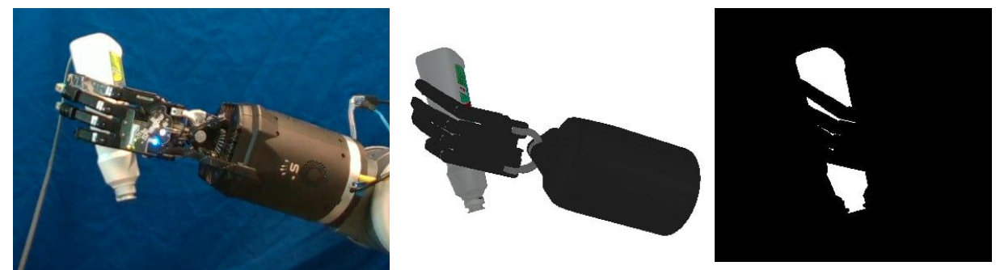
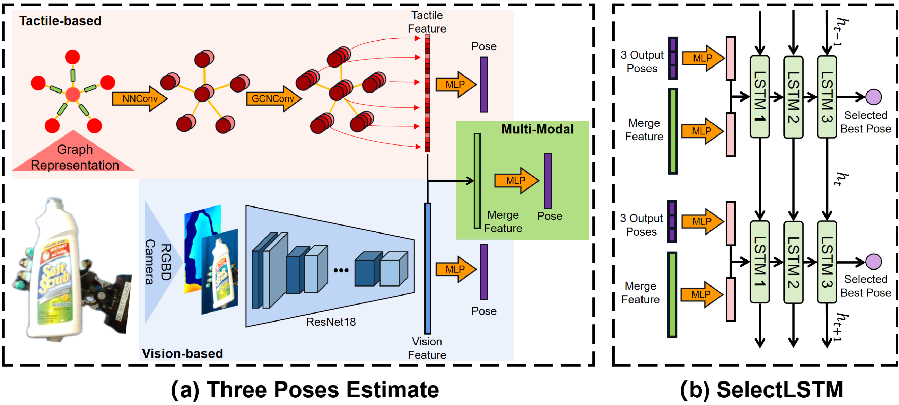

[Yuyang Tu](https://tams.informatik.uni-hamburg.de/people/tu/), [Junnan Jiang](https://elevenjiang1.github.io/), [Shuang Li](https://tams.informatik.uni-hamburg.de/people/sli/), [Norman Hendrich](https://tams.informatik.uni-hamburg.de/people/hendrich/index.php), [Miao Li](https://miaoli.github.io/) and [Jianwei Zhang](https://tams.informatik.uni-hamburg.de/people/zhang/)

*****

## 1.Introduction
The overall setup for the ObjectInHand dataset collection, we use Intel RealSense SR300 for hand pose tracking to control the Shadow hand for in-hand dexterous manipulation, and Intel RealSense D435 is collecting RGB-D data for object pose estimation. The transmitter can generate a magnetic field for the 6D pose sensor, which is used to label the ground truth of the object pose.

## 2. Dataset
### 2.1 Dataset properties

(a) Shows 7 different objects in the ObjectInHand dataset including symmetric objects and hard-to-manipulate objects. (b) Shows different initial robot hand poses in the ObjectInHand dataset. The first column is the baseline scenario, the object is in front of the hand, followed by other derived scenarios object on the hand, object under the hand, object at the back of the hand, object close to the camera, object far from the camera, bad illumination.

### 2.2 Dataset extraction
We upload all our dataset in [GoogleDrive](https://drive.google.com/drive/folders/15-xEcJt1EQ4qDDvfApL3PypsA4JlMyn-), and example code for data extraction can be available from [github](https://github.com/elevenjiang1/ObjectInHand-Dataset). 

Also, a finetune with Shadow Hand mask and contact dataset can be available from [GoogleDrive](https://drive.google.com/drive/folders/1gvFa_img_y1sj1sz0HtcSKNG2ysTt9G_?usp=sharing), the mask is generated in pybullet.

## 3. 6D pose estimate and selection

The whole pipeline of PoseFusion. First, tactile data including electrode reading and fingertip pose, and vision data including RGB image and point cloud are processed separately for feature extraction and pose estimation. Then the merge feature including tactile and vision features is also used for pose estimation. Finally, the three output poses and the merge feature are fed into SelectLSTM for the best pose selection among the three poses, which aims to avoid the error of the modal data collapse.

## 4. Videos

<iframe width="560" height="315" src="https://www.youtube.com/embed/EmsGwhWU5y8" title="YouTube video player" frameborder="0" allow="accelerometer; autoplay; clipboard-write; encrypted-media; gyroscope; picture-in-picture; web-share" allowfullscreen></iframe>

